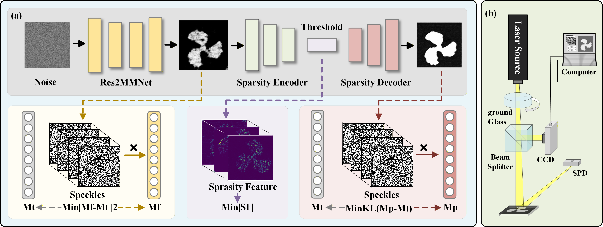
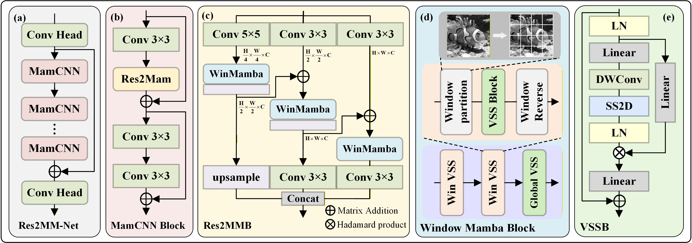
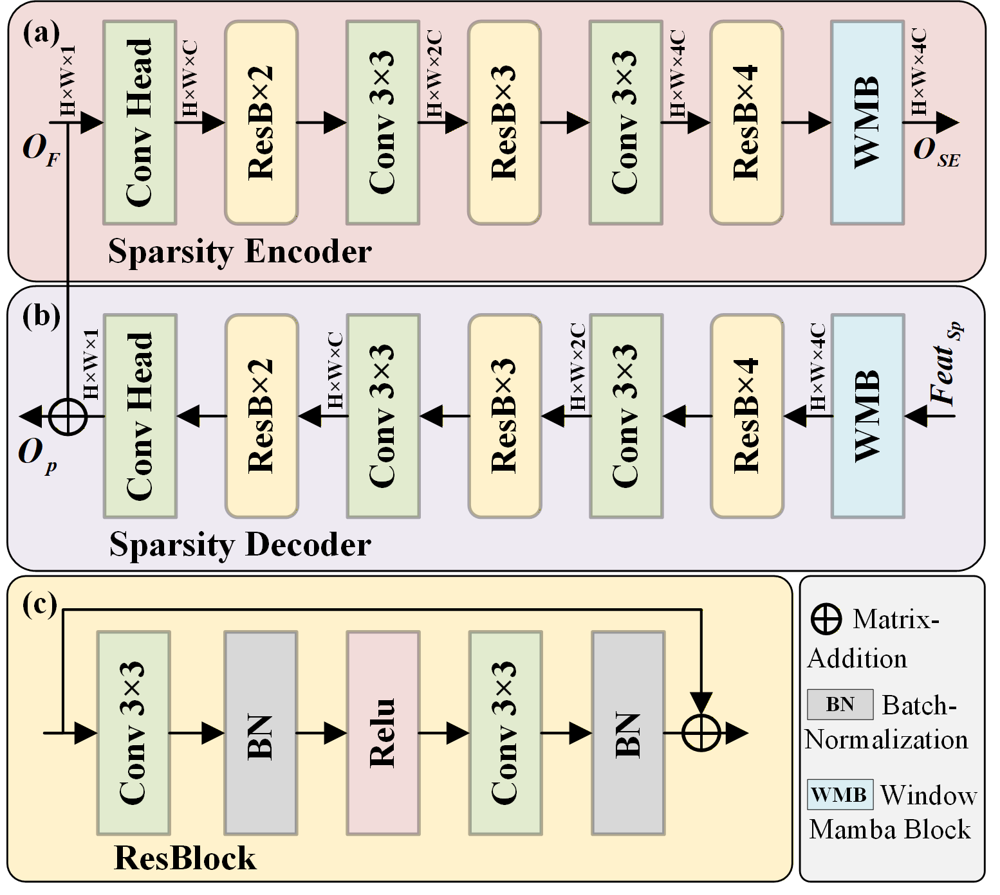
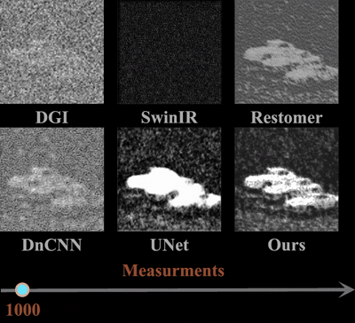

# SISTA-Net: Compressive Sensing-Inspired Self-Supervised Single-Pixel Imaging
[](https://arxiv.org/abs/25XX.XXXXX)
[](https://github.com/your-username/your-repo-name)
[](https://pytorch.org/)

Official PyTorch implementation of the paper **"Compressive Sensing-Inspired Self-Supervised Single-Pixel Imaging"** .

---

## 📑 Pipeline

The overall pipeline of our proposed SISTA\-Net, integrating compressive sensing theory with self-supervised networks for physically interpretable reconstruction.

---

## 🏗️ Model Architecture
### Res2MM-Net

A multi-scale residual network with Mamba blocks for efficient feature extraction and measurement fidelity preservation in the imaging pipeline.

### ProximalNet

<div align="center" style="width: 100%; margin: 0 auto;">
  
</div>

<div>
  A lightweight proximal mapping network designed for adaptive sparse constraint enforcement in the latent feature domain.
</div>

---

## 🧪 Simulation Experiments


Comparison of reconstruction performance across different sampling rates.
Demonstrates our method's superiority, especially in low-sampling scenarios.

---

## 🚢 Real-World Experiments

Experimental results on real-world underwater environment, showing robust reconstruction quality under practical noise and interference conditions.

---

## 📄 Citation
If you find this work useful in your research, please cite our paper:
```bibtex
@article{yourname2026advancedimaging,
  title={Compressive Sensing-Inspired Self-Supervised Single-Pixel Imaging},
  author={Your Name and Co-authors},
  journal={Advanced Imaging},
  year={2026},
  publisher={Publisher Name}
}